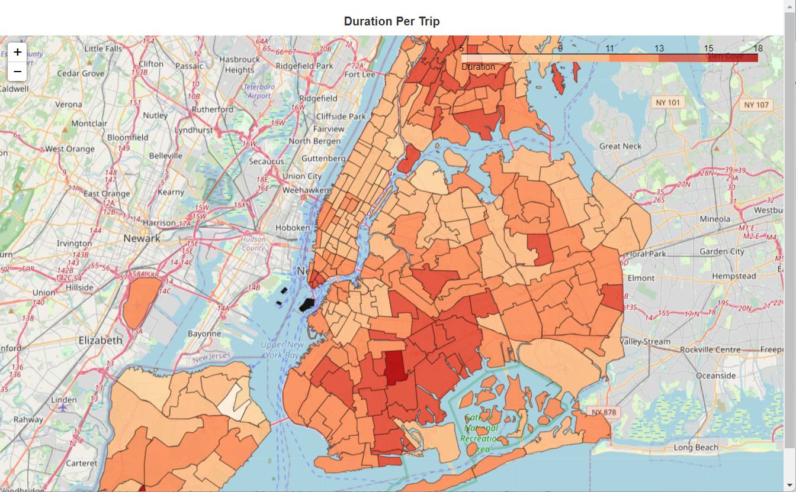
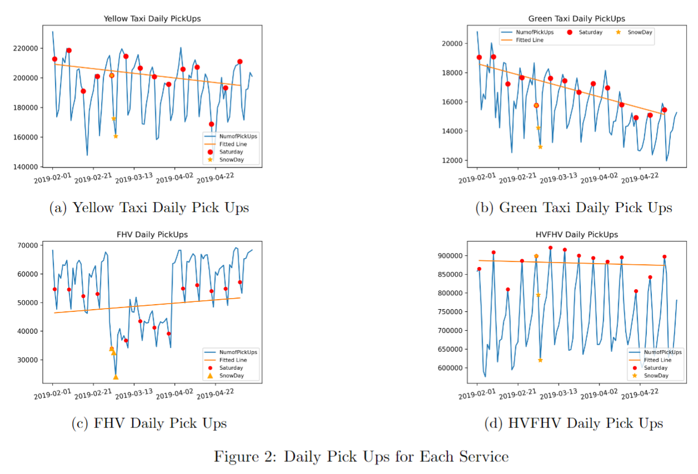
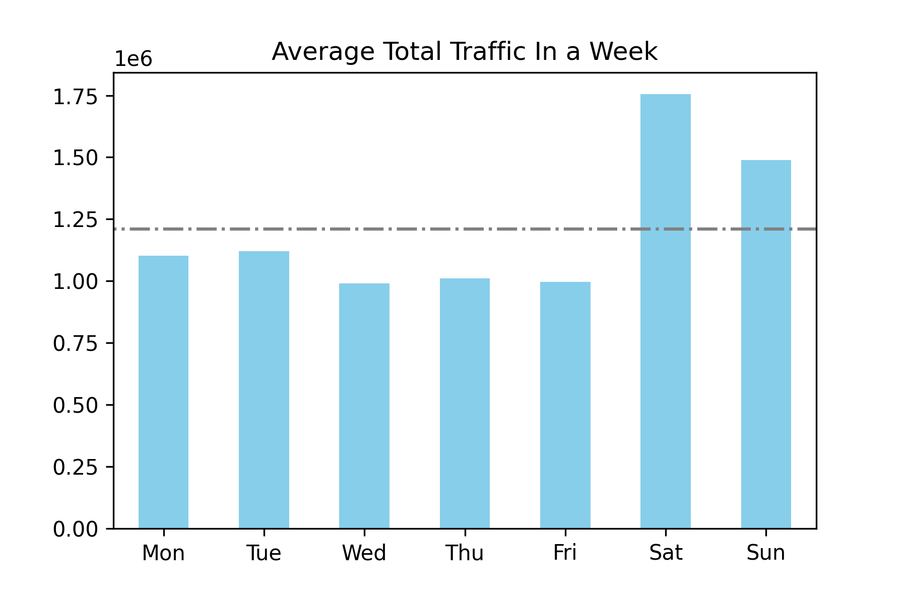
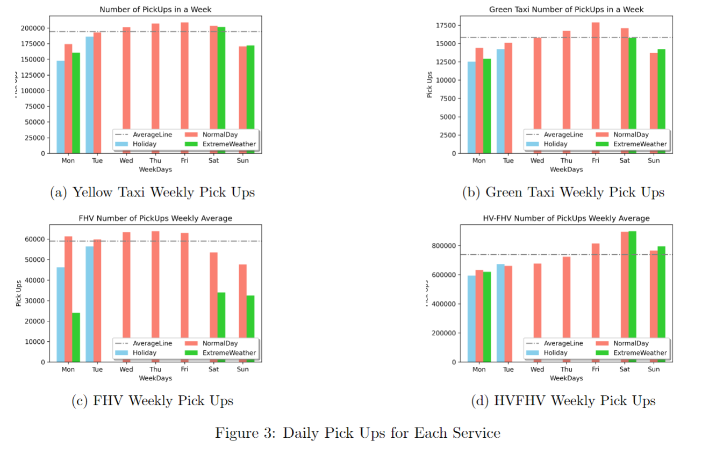
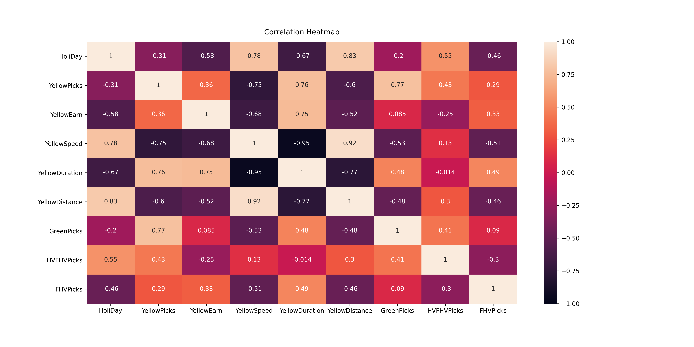
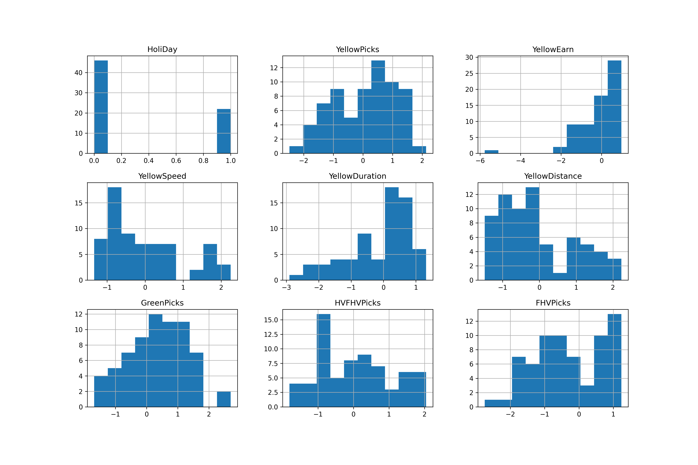
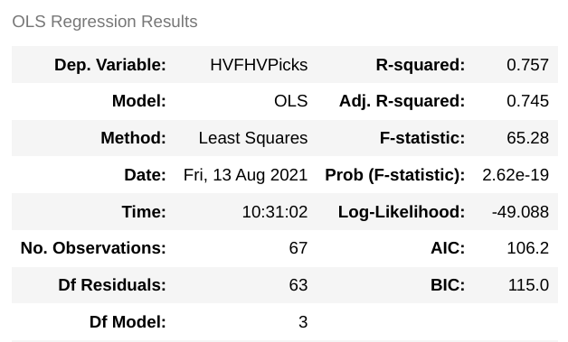
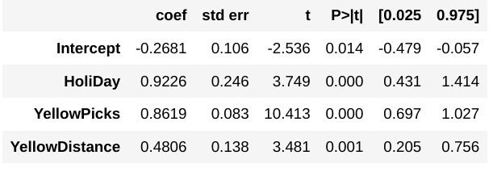
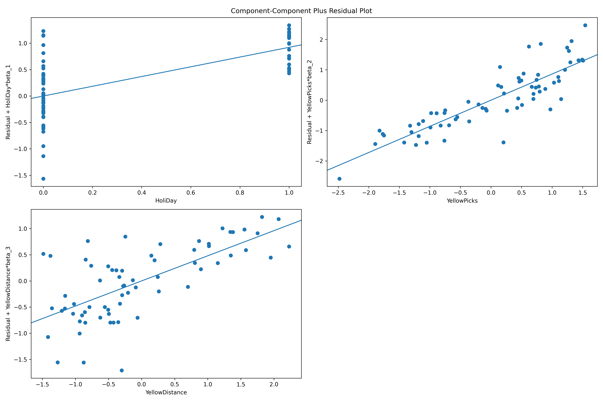
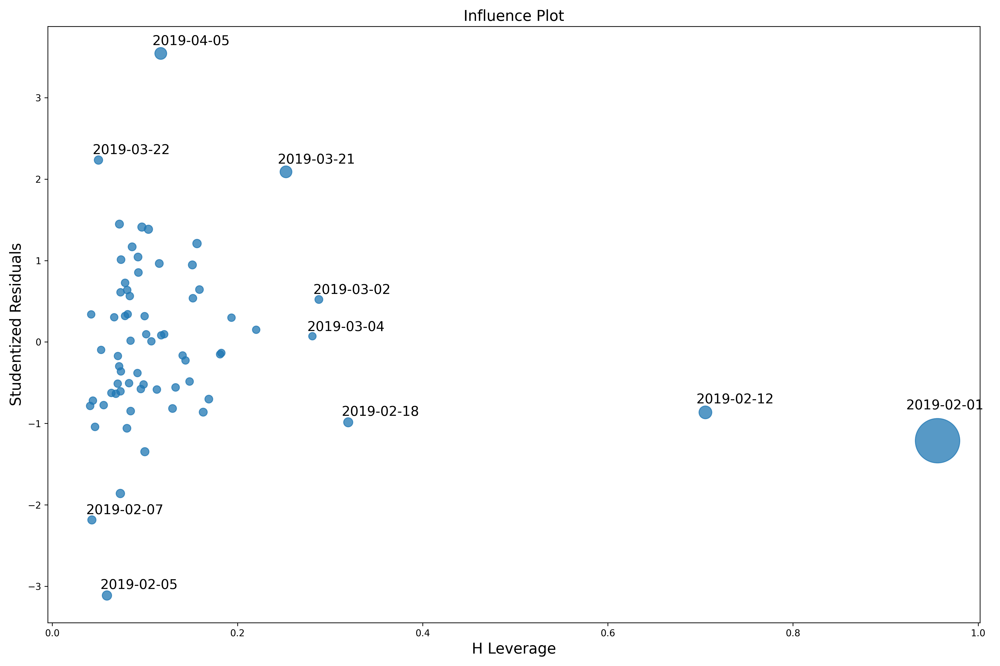

# :collision: Taxi vs Uber Analysis and Recommendations for Taxi Services :collision:

#### Table of Contents  
1. [Business Problem Address](#business-problem-address)  
2. [Environment and Dataset](#environment-and-dataset) 
3. [Exploration and Analysis](#data-exploration-and-analysis)
4. [Prediction and Model Performance](#prediction-and-model-performance)
5. [Recommendations For Taxis Services](#recommendations-for-taxis-services)
6. [Other Details](#more-details)

## Business Problem Address
This project aims to solve this real-world business partner's problems:

``` 
Understande the senario where shared-riding services succeed and providing recommendations for traditional services stakeholders.
Based on the underlying relations of traditional taxi services and competitive shared-riding services such as Uber
```

## Environment and Dataset

#### Dependencies
```
- Os: Ubuntu 20.04
- Storage: 30GB+
- Language: Python 3.9
- Packages / Libraries: 
  - pandas,
  - pyspark, 
  - sklearn, 
  - statsmodels, 
  - folium, 
  - os, 
  - bokeh, 
  - geopandas, 
  - numpy, 
  - seaborn, 
  - matplotlib.pyplot, 
  - statsmodels
  ```

### Datasets
Over 20GB+ data has been used in this project.
- NYC TLC: https://www1.nyc.gov/site/tlc/about/tlc-trip-record-data.page
- NYC Traffic Data: https://data.cityofnewyork.us/Transportation/Traffic-Volume-Counts-2014-2019-/ertz-hr4r
- NYC Extreme Weather: https://www.weather.gov/okx/stormevents

#### Data Geo-Visualize


## Data Exploration and Analysis

#### Analysing Whole Time Frame trends


- Yellow/Green Taxi's business performance is descresing.
- HVFHV (Share-riding services such as Uber)'s business performance is stable.
- The whole graph trending as a time-series data (wave shape, up and down.)
- Need further Analysis towards smaller time frame.

#### General Traffic Conditions over the week


- More traffic during the weekend.
- Less traffic in the middle of the week (Wed, Thu, Fri).
- Saturday is the peak day of the week.

#### Analysing Week-Wise trends


- Green/Yello Taxis are popular mostly towards Thursday and Friday.
- Uber (HVFHV) got most businesses during the weekend and holiday.
- Traditional Taxi services need to focus on non-work day business promotions.

### Data Summary
```
Considering different time-scaled analysis above and combining with the general traffic condition over the week. 
It is interesting that the Traditional Taxi's performance is not that good during the non-working day such as weekend and holiday. 
It also less competitive given an extreme weather condition (snow, rain etc. And the service performance of Taxi is decreasing over time, which is a dangerous sign given share-riding services such as Uber maintains their business performance level.
```
Next, a multi-factor Linear model has been built to enable our taxi business partner to predict their business performance based on other factors.

## Prediction and Model Performance

### Modelling

$Y = \beta X  + \epsilon$

#### All parameters




- This is potentially the parameters could be included in our linear model.
- Too many features to build a mode, we need model selection.

### Model Selection

Data has been standardized, mapping to standard normal distributions to enable us compare the coefficient of the linear model.

- The model implements default F-test rather than Likelihood Ratio Test as two are proved the same in our case.
- Several entries have been removed to improve the model’s goodness of fitness by examining the outlier graph using cook distance.
- The model is further selected based on visualising component-component based graph and calling StepAIC11 function to remove insignificant variables. 
- AIC is preferred over than Likelihood Ratio Test as AIC doesn’t restrict nested models to compare.
- Interaction among attributes has been tested with ANOVA.

#### Selected Model

$HVFHVPicks = -0.27 + 0.92*isHoliDay+0.86*YellowTaxiPicks+0.48*YellowTaxiDistance$

#### Linear Model Visualize and Diagnostics.

Model Statistics       |  Model Parameters
:-------------------------:|:-------------------------:
   |   

#### Linear Trend


#### Influence Plot


## Recommendations For Taxis Services
##### From technical levels: 
- Equip advanced technologies such as easily used and customer favourable mobile Apps.
- Algorithmic rating systems to make their service interact more with customers.

##### Marketing levels: 
- promotion campaign should focus more on leisure holiday-travelling topic to increase their trips volume.
- Such as: the idea that taking Taxis during holidays is somehow a better choice rather than calling a Uber or drive their own cars should be promoted. 
- This can be done by giving away specific free coupons that can only be used during holidays.

##### Inherit trait levels:
- traditional taxis and FHV should take advantages of their inherit safety and liable services recognised by public within history.
- Under the goverment close scrutiny, taxi might be much safer or reliable than Uber-like companies.
- since the sources support that Uber and other share-riding company is more like a recently rapidly developed services without too much histories. 

##### From our model: 
- With the linear relationship between Taxi and HVFHV(Uber) been found, it is safe to conclude that two has interconnected relationships.
- The competition between traditional transportation services and shared-riding services is highly possible to be an example of how contemporary technologies boost the traditional industries. 
- The logic behind this is that two parties are closely correlated, with one has the ability to predict the other's business performance, it is possible for Taxi services to "adjust" a few of their business variables to catch up with the Uber-like services.
  
### To General Audience: 

- The competitions between those giant service providers will benefit the local citizens enjoying rides of higher quality and safety with lower cost.

## More Details

- Full Report Link: https://www.overleaf.com/read/qwcptssmfnvg
  
### Repository Directory
- `raw_data`: Contains all the raw data files. External Can be download through "DownloadData.ipynb" and "ExternalData.ipynb" notebook.
- `preprocessed_data`: Contains all the preprocessed data files. Run notebook "Preprocessing.ipynb" should generate and save all needed preprocessed data.
- `plots`: Output and saved plots.
- `code`: 
    - "DownloadData.ipynb" for "Downloading Data" and "Installing Packages".
    - "ExternalData.ipynb" for "Accesing and Downloading, Preprocessing External Data".
    - "Preprocessing.ipynb" for "Data preprocessing, feature engineering and saving to local".
    - "GeoMap.ipynb" for "Data Visualization within Geolocational map".
    - "OverAllAnalysis.ipynb" for "Data Aggregation and Visualisation on a Daily or Weekly Basis".
    - "Correlation.ipynb" for "Finding initial underlying linear relations between attributes".
    - "LinearModel.ipynb" for "Statistical Modelling".

#### Other

- Big thanks to https://github.com/akiratwang/ for teaching me PySpark and general knowledge.
- How to install and use PySpark? https://github.com/akiratwang/MAST30034_Python/blob/main/advanced_tutorials/
